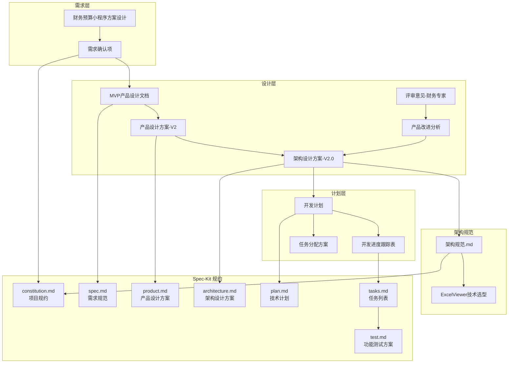

# 财务预算管理系统 - 文档索引

> 本文档整合项目所有相关文档，为 Spec-Driven Development 提供完整的上下文。

---

## 一、规约文档体系 (.specify/memory/)

### 核心规约

| 文档 | 路径 | 说明 |
|------|------|------|
| **constitution.md** | [查看](constitution.md) | 项目规约：技术栈约束、代码规范、安全合规原则 |
| **spec.md** | [查看](spec.md) | 需求规范：功能需求、用户故事、验收标准 |
| **product.md** | [查看](product.md) | 产品设计方案：PRD、功能模块、用户流程 |
| **architecture.md** | [查看](architecture.md) | 架构设计方案：技术选型、数据库、API 设计 |
| **plan.md** | [查看](plan.md) | 技术实现计划：MVP 拆解、开发计划 |
| **tasks.md** | [查看](tasks.md) | 任务列表：可执行的开发任务 |
| **test.md** | [查看](test.md) | 功能测试方案：测试用例、验收标准 |
| **index.md** | 本文档 | 文档索引：整合所有项目文档 |

---

## 二、需求文档 (docs/demand/)

### 2.1 财务预算小程序方案设计

> **路径**: [docs/demand/财务预算小程序方案设计.md](../../docs/demand/财务预算小程序方案设计.md)

**摘要**:
- **需求背景**: 公司每个季度/年度做部门预算，以前通过Excel管理，费时费力
- **用户期望**:
  - PC端进行预算管理（模板、方案、录入、追踪）
  - 移动端查看本部门预算（只读）
  - 按周期/预算编码进行查询
- **用户操作流程**:
  1. 财务管理员创建预算模板，指定上报部门
  2. 预算提交人上传填写好的Excel表单
  3. 钉钉通知财务管理员审批
  4. 审批不通过则重新修改上传
  5. 审批通过自动定稿

### 2.2 需求确认项

> **路径**: [docs/demand/需求确认项.md](../../docs/demand/需求确认项.md)

**已确认的关键决策**:

| 类别 | 确认项 | 决策 |
|------|--------|------|
| **技术栈** | 后端框架 | Python + FastAPI |
| **技术栈** | 数据库 | MySQL |
| **技术栈** | 前端框架 | React (PC+H5同一套) |
| **技术栈** | 文件存储 | 华为云OBS |
| **技术栈** | 文件大小限制 | 10MB |
| **钉钉集成** | 登录方式 | 天一泓统一钉钉登录 |
| **钉钉集成** | 通知方式 | 钉钉工作通知 (官方API) |
| **模板管理** | 模板格式 | 允许自定义列 |
| **模板管理** | 版本管理 | 需要保留历史版本 |
| **模板管理** | 部门配置 | 一个模板对应多个部门 |
| **预算提交** | 提交人 | 部门总监和指定员工 |
| **预算提交** | 重复提交 | 允许（覆盖） |
| **审批流程** | 审批级别 | 先单级审批 |
| **版本策略** | 版本管理 | 修改重新提交算新版本 |
| **权限管理** | 角色 | 财务管理员、预算提交人 |
| **项目状态** | 代码基础 | 从零开始 |
| **部署环境** | 部署方式 | 华为云 (公有云) |

---

## 三、设计文档 (docs/design/)

### 3.1 产品设计

| 文档 | 版本 | 说明 |
|------|------|------|
| [MVP产品设计文档.md](../../docs/design/MVP产品设计文档.md) | V1.0 | MVP版本功能设计 |
| [产品设计方案.md](../../docs/design/产品设计方案.md) | V1.0 | 初版产品设计 |
| [产品设计方案-V2.md](../../docs/design/产品设计方案-V2.md) | V2.0 | 增强版产品设计 |

### 3.2 架构设计

| 文档 | 版本 | 说明 |
|------|------|------|
| [架构设计方案-V1.0.md](../../docs/design/架构设计方案-V1.0.md) | V1.0 | 初版架构设计 (已归档) |
| [架构设计方案-V2.0.md](../../docs/design/架构设计方案-V2.0.md) | V2.0 | **当前版本**，含预算版本管理、操作日志、安全增强 |

### 3.3 评审与改进

| 文档 | 说明 |
|------|------|
| [评审意见-财务专家.md](../../docs/design/评审意见-财务专家.md) | 财务专家评审反馈 |
| [产品改进分析-基于财务专家评审.md](../../docs/design/产品改进分析-基于财务专家评审.md) | 基于评审的改进分析 |

---

## 四、计划文档 (docs/plan/)

### 4.1 开发计划

> **路径**: [docs/plan/开发计划.md](../../docs/plan/开发计划.md)

**项目周期**: 5.5周

| 阶段 | 周期 | 内容 |
|------|------|------|
| Phase 1 | 2.5周 | MVP核心功能（框架、认证、模板、提交、审批） |
| Phase 2 | 2周 | V2.0增强（版本管理、操作日志、报表、安全） |
| Phase 3 | 1周 | 移动端 & 测试部署 |

### 4.2 开发进度跟踪表

> **路径**: [docs/plan/开发进度跟踪表.md](../../docs/plan/开发进度跟踪表.md)

**当前状态**: 未开始

| 里程碑 | 目标 | 状态 |
|--------|------|------|
| M1 | 基础框架 + 登录认证 | 🔴 未开始 |
| M2 | 模板管理 + 预算提交 | 🔴 未开始 |
| M3 | 审批流程 | 🔴 未开始 |
| M4 | V2.0功能 | 🔴 未开始 |
| M5 | 全部功能上线 | 🔴 未开始 |

---

## 五、架构规范文档 (docs/architecture/)

> **新增目录**: 存放开发规范和技术选型文档

| 文档 | 说明 |
|------|------|
| [架构规范.md](../../docs/architecture/架构规范.md) | 前后端目录结构、代码规范、Git规范、API设计规范 |
| [ExcelViewer技术选型.md](../../docs/architecture/ExcelViewer技术选型.md) | Excel预览组件技术选型（SheetJS + 自研方案） |

### 5.1 架构规范概要

**前端目录结构**:
```
frontend/src/
├── components/    # 公共组件
├── pages/         # 页面 (pc/ + mobile/)
├── services/      # API服务
├── stores/        # 状态管理 (Zustand)
├── types/         # TypeScript类型
├── utils/         # 工具函数
└── router/        # 路由配置
```

**后端目录结构**:
```
backend/app/
├── api/v1/        # API接口
├── core/          # 核心模块
├── models/        # 数据模型
├── schemas/       # Pydantic模式
├── services/      # 业务逻辑
├── db/            # 数据库
└── utils/         # 工具模块
```

---

## 六、其他参考文档

| 文档 | 路径 | 说明 |
|------|------|------|
| SSO免登实现流程 | [SSO免登实现流程.md](../../SSO免登实现流程.md) | MaxKey + SaToken SSO集成指南 |

---

## 七、文档关系图



---

**版本**: 1.1.0 | **创建日期**: 2025-12-26 | **更新日期**: 2025-12-27

