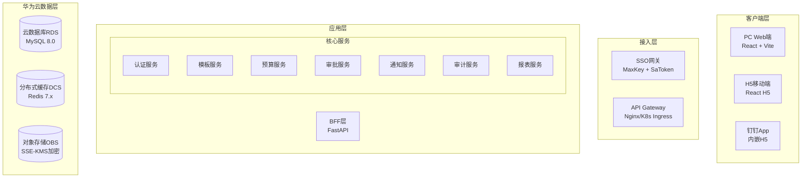

# 财务预算管理系统 - 技术实现计划 (Plan)

> 本文档定义了系统的技术架构和实现方案，基于架构设计方案 V2.0 整理。

## 一、技术架构概览

### 1.1 系统架构



### 1.2 技术栈选型

详见 [constitution.md](constitution.md) 中的技术栈约束。

---

## 二、前端架构

### 2.1 项目结构

```
frontend/
├── public/
├── src/
│   ├── assets/              # 静态资源
│   ├── components/          # 公共组件
│   │   ├── Layout/          # 布局组件
│   │   ├── ExcelViewer/     # Excel在线查看器
│   │   ├── FileUpload/      # 文件上传组件
│   │   ├── VersionHistory/  # 版本历史组件
│   │   └── common/          # 通用组件
│   ├── contexts/            # React Context
│   ├── hooks/               # 自定义Hooks
│   ├── pages/               # 页面组件
│   │   ├── pc/              # PC端页面
│   │   └── mobile/          # H5移动端页面
│   ├── services/            # API服务
│   ├── stores/              # 状态管理 (Zustand)
│   ├── types/               # TypeScript类型
│   ├── utils/               # 工具函数
│   └── router/              # 路由配置
├── vite.config.ts
└── package.json
```

### 2.2 核心依赖

```json
{
  "dependencies": {
    "react": "^18.x",
    "react-dom": "^18.x",
    "react-router-dom": "^6.x",
    "antd": "^5.x",
    "zustand": "^4.x",
    "axios": "^1.x",
    "xlsx": "latest",
    "echarts": "^5.x"
  },
  "devDependencies": {
    "typescript": "^5.x",
    "vite": "^5.x",
    "eslint": "^8.x",
    "prettier": "^3.x"
  }
}
```

---

## 三、后端架构

### 3.1 项目结构

```
backend/
├── app/
│   ├── api/
│   │   ├── v1/
│   │   │   ├── endpoints/
│   │   │   │   ├── auth.py
│   │   │   │   ├── sso_auth.py
│   │   │   │   ├── template.py
│   │   │   │   ├── budget.py
│   │   │   │   ├── approval.py
│   │   │   │   ├── report.py
│   │   │   │   └── audit_log.py
│   │   │   └── router.py
│   │   └── deps.py
│   ├── core/
│   │   ├── config.py
│   │   ├── security.py
│   │   ├── exceptions.py
│   │   └── audit.py
│   ├── models/
│   │   ├── user.py
│   │   ├── department.py
│   │   ├── template.py
│   │   ├── budget.py
│   │   ├── budget_version.py
│   │   └── operation_log.py
│   ├── schemas/
│   ├── services/
│   │   ├── auth_service.py
│   │   ├── template_service.py
│   │   ├── budget_service.py
│   │   ├── approval_service.py
│   │   ├── file_service.py
│   │   ├── version_service.py
│   │   ├── audit_service.py
│   │   └── report_service.py
│   ├── db/
│   ├── utils/
│   │   ├── obs.py
│   │   ├── excel.py
│   │   ├── watermark.py
│   │   └── code_generator.py
│   └── main.py
├── migrations/
├── tests/
├── Dockerfile
└── pyproject.toml
```

### 3.2 核心依赖

```toml
[project]
dependencies = [
    "fastapi>=0.100.0",
    "uvicorn>=0.20.0",
    "sqlalchemy>=2.0.0",
    "alembic>=1.0.0",
    "pydantic>=2.0.0",
    "pydantic-settings>=2.0.0",
    "httpx>=0.24.0",
    "python-multipart>=0.0.6",
    "python-jose[cryptography]>=3.3.0",
    "esdk-obs-python>=3.0.0",
    "openpyxl>=3.1.0",
    "redis>=5.0.0",
]
```

---

## 四、数据库设计

### 4.1 核心表结构

| 表名 | 说明 |
|------|------|
| `users` | 用户表 |
| `departments` | 部门表 |
| `templates` | 预算模板表 |
| `template_departments` | 模板-部门关联表 |
| `budgets` | 预算表 |
| `budget_versions` | 预算版本表 (V2.0) |
| `approval_logs` | 审批日志表 |
| `operation_logs` | 操作日志表 (V2.0) |

### 4.2 ER图

详见 [架构设计方案-V2.0.md](../../docs/design/架构设计方案-V2.0.md) 第五章。

---

## 五、API 设计

### 5.1 接口规范

- **Base URL**: `/api/v1`
- **认证**: Bearer Token (JWT)
- **响应格式**: 统一 JSON

```typescript
interface ApiResponse<T> {
  code: number;      // 0=成功
  message: string;
  data: T;
}
```

### 5.2 核心接口清单

| 模块 | 方法 | 路径 | 说明 |
|------|------|------|------|
| **认证** | POST | `/sso/login` | SSO登录 |
| **模板** | POST | `/templates` | 创建模板 |
| **模板** | GET | `/templates` | 模板列表 |
| **预算** | POST | `/budgets` | 提交预算 |
| **预算** | GET | `/budgets/mine` | 我的预算 |
| **预算** | GET | `/budgets/{id}/versions` | 版本列表 |
| **审批** | GET | `/approvals/pending` | 待审批列表 |
| **审批** | POST | `/approvals/{id}/approve` | 审批通过 |
| **审批** | POST | `/approvals/{id}/reject` | 审批驳回 |
| **报表** | GET | `/reports/summary` | 预算汇总 |
| **审计** | GET | `/audit-logs` | 操作日志 |

---

## 六、部署架构

### 6.1 华为云部署拓扑

| 服务 | 规格 | 数量 |
|------|------|------|
| CCE 节点 | 4C8G | 2 |
| 前端 Pod | 1C1G | 2 |
| 后端 Pod | 1C1G | 2 |
| RDS MySQL | 2C4G | 1 主 |
| DCS Redis | 2G | 1 |

### 6.2 域名规划

| 环境 | 域名 |
|------|------|
| 开发 | `budget.tyhdev.com` |
| 生产 | `budget.tyhsys.com` |

---

## 七、开发阶段划分

### Phase 1: 核心框架搭建 (3天)

- [ ] 前端项目初始化 (Vite + React + TS)
- [ ] 后端项目初始化 (FastAPI)
- [ ] 数据库初始化
- [ ] SSO 登录集成

### Phase 2: 模板管理 (5天)

- [ ] 模板 CRUD API
- [ ] OBS 文件上传
- [ ] 创建模板页面
- [ ] 模板列表页面

### Phase 3: 预算提交 (5天)

- [ ] 预算提交 API
- [ ] Excel 在线预览
- [ ] 提交预算页面
- [ ] 我的预算列表

### Phase 4: 审批流程 (4天)

- [ ] 审批 API
- [ ] 待审批列表
- [ ] 审批详情页
- [ ] 钉钉通知

### Phase 5: V2.0 增强 (5天)

- [ ] 预算版本管理
- [ ] 操作日志
- [ ] 预算汇总报表

### Phase 6: 移动端 & 测试 (4天)

- [ ] H5 移动端页面
- [ ] 系统测试
- [ ] 部署上线

---

## 八、相关文档

- [Constitution 项目规约](constitution.md)
- [Spec 需求规范](spec.md)
- [架构设计方案 V2.0](../../docs/design/架构设计方案-V2.0.md)
- [MVP 产品设计文档](../../docs/design/MVP产品设计文档.md)

---

**版本**: 1.0.0 | **创建日期**: 2025-12-26 | **基于**: 架构设计方案 V2.0
