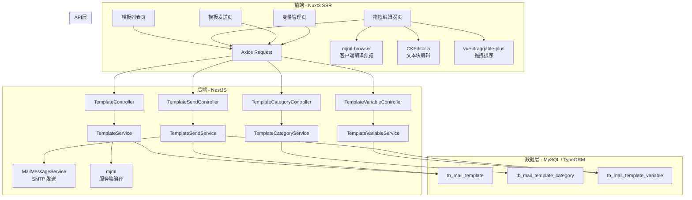
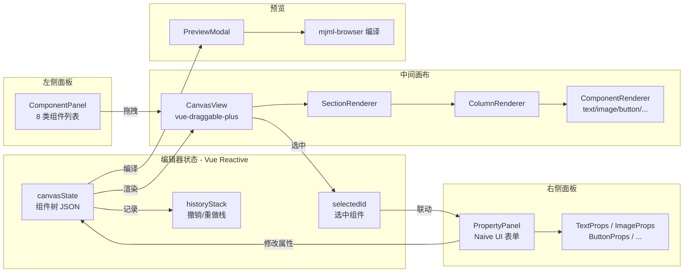
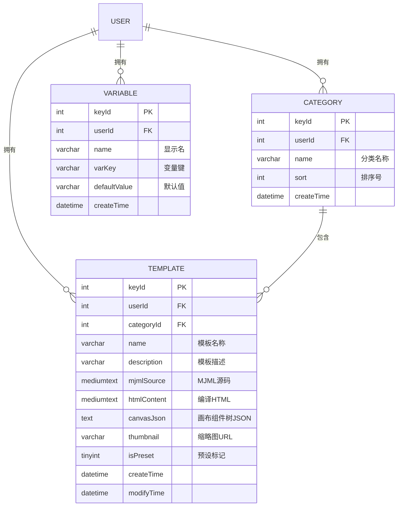
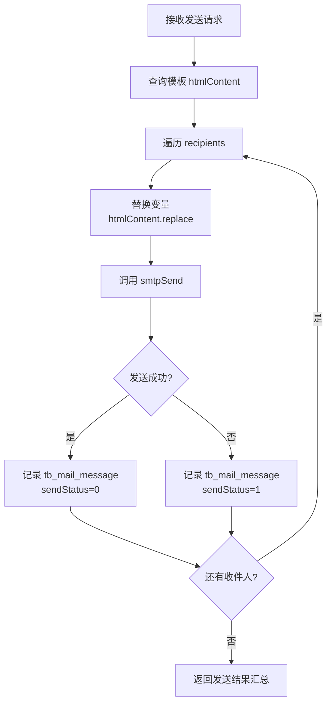

# 邮件模板管理 - 架构设计 V1

## 1. 系统架构

### 1.1 整体架构



### 1.2 拖拽编辑器架构



## 2. 技术选型

| 层级 | 技术 | 版本 | 选型理由 |
|------|------|------|----------|
| 前端框架 | Nuxt 3 + Vue 3 TSX | 项目现有 | 保持技术栈统一 |
| UI 组件库 | Naive UI | 项目现有 | 保持一致性 |
| 富文本编辑 | CKEditor 5 | 已集成 | 写邮件页已使用，复用 |
| 拖拽排序 | vue-draggable-plus | latest | 基于 sortablejs，Vue 3 原生支持，API 简洁 |
| 邮件模板 DSL | mjml | 5.x | 业界标准邮件模板语言，兼容所有邮件客户端 |
| 客户端编译 | mjml-browser | 5.x | 浏览器端 MJML→HTML 实时预览 |
| 后端框架 | NestJS | 项目现有 | 保持统一 |
| ORM | TypeORM | 项目现有 | synchronize 自动同步表结构 |
| 数据库 | MySQL | 项目现有 | 保持统一 |
| SMTP | nodemailer | 已集成 | 复用现有发送通道 |

### 新增依赖

```bash
# 前端
yarn add mjml-browser vue-draggable-plus

# 后端
yarn add mjml
```

## 3. 数据模型

### 3.1 ER 关系图



### 3.2 Schema 定义

#### tb_mail_template

| 字段 | 类型 | 约束 | 说明 |
|------|------|------|------|
| keyId | int | PK, AUTO_INCREMENT | 主键 |
| userId | int | NOT NULL, INDEX | 所属用户 |
| categoryId | int | NULLABLE, INDEX | 分类 ID，null 为未分类 |
| name | varchar(100) | NOT NULL | 模板名称 |
| description | varchar(500) | DEFAULT '' | 模板描述 |
| mjmlSource | mediumtext | NULLABLE | MJML 源码 |
| htmlContent | mediumtext | NULLABLE | 编译后 HTML |
| canvasJson | text | NULLABLE | 编辑器画布组件树 JSON（用于回显编辑） |
| thumbnail | varchar(500) | DEFAULT '' | 缩略图 URL |
| isPreset | tinyint | DEFAULT 0 | 0=用户模板，1=预设模板 |
| createTime | datetime | NOT NULL | 创建时间 |
| modifyTime | datetime | NOT NULL | 修改时间 |

> **设计决策**：增加 `canvasJson` 字段存储编辑器的组件树结构（JSON），因为 MJML 源码是编译产物，无法 1:1 反推回编辑器状态。保存时同时存 canvasJson（编辑用）+ mjmlSource（预览用）+ htmlContent（发送用）。

#### tb_mail_template_category

| 字段 | 类型 | 约束 | 说明 |
|------|------|------|------|
| keyId | int | PK, AUTO_INCREMENT | 主键 |
| userId | int | NOT NULL, INDEX | 所属用户 |
| name | varchar(50) | NOT NULL | 分类名称 |
| sort | int | DEFAULT 0 | 排序号 |
| createTime | datetime | NOT NULL | 创建时间 |

#### tb_mail_template_variable

| 字段 | 类型 | 约束 | 说明 |
|------|------|------|------|
| keyId | int | PK, AUTO_INCREMENT | 主键 |
| userId | int | NOT NULL, INDEX | 所属用户 |
| name | varchar(50) | NOT NULL | 显示名（如「姓名」） |
| varKey | varchar(50) | NOT NULL | 变量键（如 `name`），同用户下唯一 |
| defaultValue | varchar(500) | DEFAULT '' | 默认值 |
| createTime | datetime | NOT NULL | 创建时间 |

**唯一约束**：`UNIQUE(userId, varKey)`

## 4. API 设计

### 4.1 模板管理

| 接口 | 方法 | 路径 | 说明 |
|------|------|------|------|
| 模板列表 | POST | `/api/mail-template/list` | 支持 categoryId 筛选 |
| 模板详情 | POST | `/api/mail-template/detail` | 返回含 canvasJson |
| 保存模板 | POST | `/api/mail-template/save` | 新建/更新（有 keyId 则更新） |
| 删除模板 | POST | `/api/mail-template/delete` | 不可删预设 |
| 复制模板 | POST | `/api/mail-template/copy` | 预设→个人副本 |
| 预览编译 | POST | `/api/mail-template/compile` | MJML→HTML 服务端编译 |

#### 保存模板 Request

```json
{
    "keyId": null,
    "categoryId": 1,
    "name": "营销推广模板",
    "description": "用于产品推广",
    "canvasJson": "[{\"type\":\"mj-section\",\"children\":[...]}]",
    "mjmlSource": "<mjml>...</mjml>"
}
```

#### 模板详情 Response

```json
{
    "keyId": 1,
    "name": "营销推广模板",
    "categoryId": 1,
    "categoryName": "营销",
    "mjmlSource": "<mjml>...</mjml>",
    "htmlContent": "<html>...</html>",
    "canvasJson": "[...]",
    "isPreset": 0,
    "createTime": "2026-03-31 12:00:00"
}
```

### 4.2 分类管理

| 接口 | 方法 | 路径 | 说明 |
|------|------|------|------|
| 分类列表 | POST | `/api/mail-template-category/list` | 当前用户分类 |
| 保存分类 | POST | `/api/mail-template-category/save` | 新建/更新 |
| 删除分类 | POST | `/api/mail-template-category/delete` | 模板归入未分类 |

### 4.3 变量管理

| 接口 | 方法 | 路径 | 说明 |
|------|------|------|------|
| 变量列表 | POST | `/api/mail-template-variable/list` | 当前用户变量 |
| 保存变量 | POST | `/api/mail-template-variable/save` | 新建/更新 |
| 删除变量 | POST | `/api/mail-template-variable/delete` | 删除变量 |

### 4.4 模板发送

| 接口 | 方法 | 路径 | 说明 |
|------|------|------|------|
| 模板发送 | POST | `/api/mail-template/send` | 支持群发 |

#### 模板发送 Request

```json
{
    "templateId": 1,
    "accountId": 1,
    "recipients": [
        {
            "email": "user1@example.com",
            "variables": { "name": "张三", "company": "A公司" }
        },
        {
            "email": "user2@example.com",
            "variables": { "name": "李四", "company": "B公司" }
        }
    ]
}
```

#### 模板发送 Response

```json
{
    "total": 2,
    "success": 1,
    "failed": 1,
    "results": [
        { "email": "user1@example.com", "status": "success" },
        { "email": "user2@example.com", "status": "failed", "error": "SMTP timeout" }
    ]
}
```

## 5. 前端模块设计

### 5.1 新增文件结构

```
web/
├── views/manager/pages/
│   ├── manager-templates.vue          # 模板列表页
│   ├── manager-template-editor.vue    # 拖拽编辑器页
│   ├── manager-template-send.vue      # 模板发送页
│   └── manager-template-vars.vue      # 变量管理页
├── views/manager/components/
│   ├── template-editor/
│   │   ├── ComponentPanel.vue         # 左侧组件面板
│   │   ├── CanvasView.vue             # 中间画布
│   │   ├── PropertyPanel.vue          # 右侧属性面板
│   │   ├── PreviewModal.vue           # 预览弹窗
│   │   ├── renderers/                 # 组件渲染器
│   │   │   ├── SectionRenderer.vue
│   │   │   ├── ColumnRenderer.vue
│   │   │   ├── TextRenderer.vue
│   │   │   ├── ImageRenderer.vue
│   │   │   ├── ButtonRenderer.vue
│   │   │   ├── DividerRenderer.vue
│   │   │   ├── SocialRenderer.vue
│   │   │   └── HeroRenderer.vue
│   │   ├── properties/                # 属性编辑器
│   │   │   ├── SectionProps.vue
│   │   │   ├── ColumnProps.vue
│   │   │   ├── TextProps.vue
│   │   │   ├── ImageProps.vue
│   │   │   ├── ButtonProps.vue
│   │   │   ├── DividerProps.vue
│   │   │   ├── SocialProps.vue
│   │   │   └── HeroProps.vue
│   │   └── useEditorState.ts          # 编辑器状态管理 composable
│   └── template-send/
│       ├── VariableForm.vue           # 变量填充表单
│       └── RecipientTable.vue         # 群发收件人表格
├── api/modules/
│   ├── web-mail-template.service.ts
│   ├── web-mail-template-category.service.ts
│   └── web-mail-template-variable.service.ts
```

### 5.2 编辑器状态设计（useEditorState）

```typescript
interface CanvasNode {
    id: string                    // uuid
    type: MjmlComponentType       // 'mj-section' | 'mj-text' | ...
    props: Record<string, any>    // 组件属性
    children?: CanvasNode[]       // 子组件（section→column→content）
}

interface EditorState {
    canvas: CanvasNode[]          // 组件树
    selectedId: string | null     // 选中组件 ID
    history: CanvasNode[][]       // 撤销栈
    historyIndex: number          // 当前历史位置
    templateName: string
    categoryId: number | null
}
```

### 5.3 MJML 编译策略

| 场景 | 编译方式 | 说明 |
|------|----------|------|
| 编辑器实时预览 | `mjml-browser`（客户端） | 避免网络延迟，即时反馈 |
| 保存模板 | `mjml`（服务端） | 确保编译结果一致性 |
| 模板发送 | 服务端直接使用已存 htmlContent | 替换变量后发送，无需重新编译 |

## 6. 后端模块设计

### 6.1 新增模块

```
server/modules/
├── mail-template/
│   ├── mail-template.module.ts
│   ├── mail-template.controller.ts
│   └── mail-template.service.ts
├── mail-template-category/
│   ├── mail-template-category.module.ts
│   ├── mail-template-category.controller.ts
│   └── mail-template-category.service.ts
├── mail-template-variable/
│   ├── mail-template-variable.module.ts
│   ├── mail-template-variable.controller.ts
│   └── mail-template-variable.service.ts
├── database/schema/
│   ├── tb_mail_template.ts
│   ├── tb_mail_template_category.ts
│   └── tb_mail_template_variable.ts
```

### 6.2 模板发送核心逻辑



## 7. 安全设计

| 维度 | 措施 |
|------|------|
| 数据隔离 | 所有查询强制 `WHERE userId = request.user.keyId` |
| 预设保护 | 预设模板 `isPreset=1` 禁止修改/删除 |
| XSS 防护 | 模板 HTML 仅用于邮件发送，不在页面直接渲染（预览使用 iframe sandbox） |
| 变量注入 | 变量替换使用纯文本替换，不执行模板引擎 |
| 认证 | 所有 API 均需 JWT 认证（`authorize: true`） |

## 8. 预设模板设计

| 编号 | 名称 | 结构 | 分类 |
|------|------|------|------|
| P1 | 空白模板 | 单 section + 单 column + 空 text | 通用 |
| P2 | 营销推广 | hero + 2列图文 + button + footer | 营销 |
| P3 | 活动邀请 | header image + text + button + divider + footer | 活动 |
| P4 | 周报模板 | title + 3 section text blocks + divider + footer | 周报 |
| P5 | 通知模板 | logo + title text + body text + button | 通知 |

预设模板以 JSON seed 数据形式存入数据库，系统启动时检查并自动初始化。
