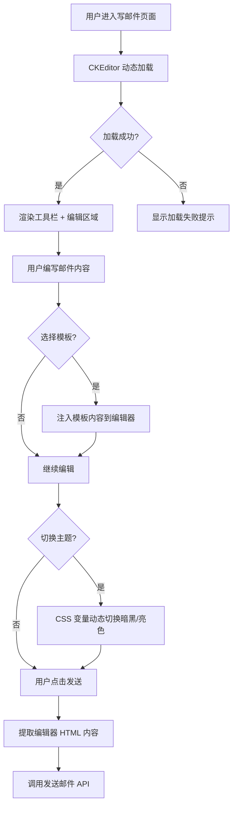

# 功能规格：邮件编辑器替换（TinyMCE → CKEditor 5）

**版本**: V1.0  
**创建日期**: 2026-03-24  
**状态**: 已定稿  
**作者**: AI Assistant

---

## 一、功能概述

### 1.1 背景与目标

当前写邮件页面（`manager-compose.vue`）使用 TinyMCE 8.3.2 作为富文本编辑器。TinyMCE 存在以下问题：

- **许可证限制**：TinyMCE 8 要求 GPL 声明配置，未来版本可能进一步收紧
- **SSR 兼容性差**：需要大量动态 `import()` 处理，初始化逻辑复杂
- **暗黑主题支持弱**：需手动导入皮肤 CSS，深色模式适配不完善
- **邮件场景支持不足**：缺乏邮件专属功能（如内联样式导出）

**目标**：将编辑器替换为 CKEditor 5（GPL 免费版），提供更好的邮件编写体验，并完整支持暗黑主题切换。

### 1.2 用户故事

```
作为 邮件系统用户
我希望 在写邮件时使用功能丰富的富文本编辑器
以便 高效编写格式化邮件内容，且在暗黑/亮色主题下都有良好的编辑体验
```

### 1.3 成功标准

| 指标             | 目标值     | 衡量方式                                       |
| ---------------- | ---------- | ---------------------------------------------- |
| 编辑器加载时间   | < 2 秒     | 页面导航到编辑器可交互的时间                   |
| 功能完整性       | 100%       | 现有 TinyMCE 的所有功能在 CKEditor 中可用      |
| 主题切换         | 无闪烁     | 暗黑/亮色切换时编辑器同步响应                  |
| SSR 兼容         | 零报错     | 服务端渲染无 `window is not defined` 等错误    |
| 邮件 HTML 兼容性 | 主流客户端 | 生成的 HTML 在 Gmail/Outlook/QQ邮箱 可正常显示 |

---

## 二、功能需求

### 2.1 核心功能

| 编号 | 功能点           | 优先级 | 描述                                                                                                                                   |
| ---- | ---------------- | ------ | -------------------------------------------------------------------------------------------------------------------------------------- |
| F001 | CKEditor 5 集成  | P0     | 替换 TinyMCE，使用 `ckeditor5` + `@ckeditor/ckeditor5-vue` GPL 版本集成                                                                |
| F002 | 暗黑主题支持     | P0     | 通过 CSS 变量（`--ck-color-*`）实现完整暗黑/亮色主题切换                                                                               |
| F003 | 富文本工具栏     | P0     | 保留全部现有功能：粗体、斜体、下划线、删除线、字体颜色、背景色、字号、对齐、列表、引用、链接、图片、表格、特殊字符、源码编辑、全屏编辑 |
| F004 | SSR 兼容         | P0     | 动态加载 CKEditor 组件，确保 Nuxt SSR 模式正常运行                                                                                     |
| F005 | 邮件内容双向绑定 | P1     | 编辑器内容与发件表单数据模型同步，支持 HTML 格式输出                                                                                   |
| F006 | 邮件模板加载     | P1     | 保留现有邮件模板选择功能，可将模板内容注入编辑器                                                                                       |
| F007 | 回复/转发引用    | P1     | 回复或转发邮件时，自动将原邮件内容加载到编辑器                                                                                         |

### 2.2 用户流程



### 2.3 技术约束

| 约束项           | 说明                                                                        |
| ---------------- | --------------------------------------------------------------------------- |
| **许可证**       | 仅使用 CKEditor 5 GPL 免费版功能，不依赖 `@ckeditor/ckeditor5-email` 付费包 |
| **包管理**       | 使用 `ckeditor5` 统一包 + `@ckeditor/ckeditor5-vue` Vue 3 组件              |
| **暗黑主题**     | 通过覆盖 CKEditor CSS 自定义属性（`--ck-color-base-background` 等）实现     |
| **SSR**          | 使用 Vue 的 `defineAsyncComponent` 或条件 `import()` 动态加载               |
| **卸载 TinyMCE** | 移除 `tinymce` 和 `@tinymce/tinymce-vue` 依赖                               |

---

## 三、编辑器插件配置

### 3.1 GPL 可用插件清单

| 插件                                           | 对应功能                       | 来源       |
| ---------------------------------------------- | ------------------------------ | ---------- |
| `Bold`, `Italic`, `Underline`, `Strikethrough` | 基础文本格式                   | ckeditor5  |
| `FontColor`, `FontBackgroundColor`             | 字体/背景颜色                  | ckeditor5  |
| `FontSize`, `FontFamily`                       | 字号/字体                      | ckeditor5  |
| `Alignment`                                    | 文本对齐                       | ckeditor5  |
| `List` (Bulleted + Numbered)                   | 有序/无序列表                  | ckeditor5  |
| `BlockQuote`                                   | 引用块                         | ckeditor5  |
| `Link`, `AutoLink`                             | 链接                           | ckeditor5  |
| `Image`, `ImageResize`                         | 图片插入与缩放                 | ckeditor5  |
| `Table`, `TableToolbar`                        | 表格                           | ckeditor5  |
| `SpecialCharacters`                            | 特殊字符                       | ckeditor5  |
| `SourceEditing`                                | 源码编辑                       | ckeditor5  |
| `FullPage` 或自定义全屏                        | 全屏编辑                       | 自定义实现 |
| `Essentials`                                   | 基础功能（撤销/重做/剪贴板等） | ckeditor5  |
| `Paragraph`, `Heading`                         | 段落/标题                      | ckeditor5  |
| `Indent`                                       | 缩进                           | ckeditor5  |
| `HorizontalLine`                               | 水平分割线                     | ckeditor5  |
| `GeneralHtmlSupport`                           | HTML 保真输出                  | ckeditor5  |

### 3.2 暗黑主题 CSS 变量映射

| CKEditor 变量                                | 亮色模式            | 暗黑模式                 |
| -------------------------------------------- | ------------------- | ------------------------ |
| `--ck-color-base-background`                 | `#fff`              | `#1e1e2e`                |
| `--ck-color-base-foreground`                 | `#fafafa`           | `#2a2a3c`                |
| `--ck-color-base-border`                     | `#c4c4c4`           | `#3a3a4c`                |
| `--ck-color-base-text`                       | `#333`              | `rgba(255,255,255,0.82)` |
| `--ck-color-toolbar-background`              | `#f0f0f0`           | `#252536`                |
| `--ck-color-toolbar-border`                  | `#c4c4c4`           | `#3a3a4c`                |
| `--ck-color-button-default-hover-background` | `#e6e6e6`           | `#3a3a4c`                |
| `--ck-color-dropdown-panel-background`       | `#fff`              | `#2a2a3c`                |
| `--ck-color-focus-border`                    | `#6366f1`           | `#818cf8`                |
| `--ck-focus-ring`                            | `1px solid #6366f1` | `1px solid #818cf8`      |

---

## 四、非功能需求

| 类型         | 要求                                          |
| ------------ | --------------------------------------------- |
| **性能**     | 编辑器初始化 < 2s，输入延迟 < 50ms            |
| **体积**     | CKEditor 打包体积不超过 500KB（gzip）         |
| **兼容**     | Chrome 90+, Firefox 90+, Edge 90+, Safari 15+ |
| **SSR**      | Nuxt SSR 模式下无报错                         |
| **可维护性** | 编辑器配置集中管理，主题通过 CSS 变量切换     |

---

## 五、验收标准

- [ ] CKEditor 5 编辑器替换 TinyMCE，页面正常加载
- [ ] 全部 17 个工具栏功能可用（粗体至全屏）
- [ ] 亮色主题下编辑器样式正常
- [ ] **暗黑主题下**编辑器工具栏 + 编辑区域完全适配
- [ ] 主题切换时编辑器无闪烁，实时响应
- [ ] 邮件模板选择后内容正确注入编辑器
- [ ] 回复/转发邮件时原内容正确加载
- [ ] 发送邮件时 HTML 内容正确提取
- [ ] SSR 模式下无错误
- [ ] TinyMCE 相关依赖已完全移除
- [ ] 用户体验无明显降级

---

## 六、附录

### 6.1 依赖变更

**卸载：**

```
tinymce
@tinymce/tinymce-vue
```

**安装：**

```
ckeditor5
@ckeditor/ckeditor5-vue
```

### 6.2 影响范围

| 文件                                          | 变更类型 | 说明              |
| --------------------------------------------- | -------- | ----------------- |
| `web/views/manager/pages/manager-compose.vue` | 重构     | 替换编辑器组件    |
| `package.json`                                | 修改     | 更换依赖          |
| `web/assets/ckeditor-dark.css`（新建）        | 新增     | 暗黑主题 CSS 变量 |

### 6.3 参考资料

- [CKEditor 5 邮件编辑器官方页面](https://ckeditor.com/solutions/wysiwyg-email-editor/#basic)
- [CKEditor 5 Vue 3 集成](https://ckeditor.com/docs/ckeditor5/latest/installation/integrations/vuejs-v3.html)
- [CKEditor 5 主题自定义](https://ckeditor.com/docs/ckeditor5/latest/framework/theme-customization.html)

### 6.4 变更记录

| 版本 | 日期       | 内容 | 作者         |
| ---- | ---------- | ---- | ------------ |
| V1.0 | 2026-03-24 | 初稿 | AI Assistant |
