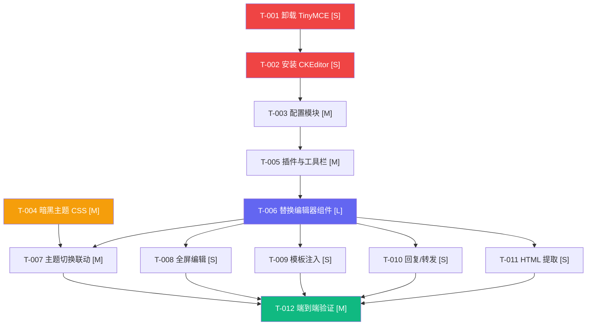

# 邮件编辑器替换（CKEditor 5） - 任务清单

## 概览

| 项目     | 数值 |
| -------- | ---- |
| 总任务数 | 12   |
| 可并行   | 4    |
| 预计工时 | 6h   |

---

## 任务列表

### US-001: CKEditor 5 基础集成

| 任务                   | 复杂度 | 并行 | 文件                                              | 状态 |
| ---------------------- | ------ | ---- | ------------------------------------------------- | ---- |
| 卸载 TinyMCE 依赖      | S      | ✅   | `package.json`                                    | ⬜   |
| 安装 CKEditor 5 依赖   | S      | ✅   | `package.json`                                    | ⬜   |
| 创建 CKEditor 配置模块 | M      | -    | `web/views/manager/components/ckeditor-config.ts` | ⬜   |
| 替换编辑器组件         | L      | -    | `web/views/manager/pages/manager-compose.vue`     | ⬜   |

### US-002: 暗黑主题适配

| 任务                  | 复杂度 | 并行 | 文件                                          | 状态 |
| --------------------- | ------ | ---- | --------------------------------------------- | ---- |
| 编写暗黑主题 CSS 变量 | M      | ✅   | `web/assets/ckeditor-dark.css`                | ⬜   |
| 主题切换联动          | M      | -    | `web/views/manager/pages/manager-compose.vue` | ⬜   |

### US-003: 功能完整性保障

| 任务                 | 复杂度 | 并行 | 文件                                              | 状态 |
| -------------------- | ------ | ---- | ------------------------------------------------- | ---- |
| 配置全部插件与工具栏 | M      | -    | `web/views/manager/components/ckeditor-config.ts` | ⬜   |
| 实现全屏编辑功能     | S      | ✅   | `web/views/manager/pages/manager-compose.vue`     | ⬜   |

### US-004: 邮件业务集成

| 任务              | 复杂度 | 并行 | 文件                                          | 状态 |
| ----------------- | ------ | ---- | --------------------------------------------- | ---- |
| 邮件模板注入      | S      | -    | `web/views/manager/pages/manager-compose.vue` | ⬜   |
| 回复/转发内容加载 | S      | -    | `web/views/manager/pages/manager-compose.vue` | ⬜   |
| 发送时 HTML 提取  | S      | -    | `web/views/manager/pages/manager-compose.vue` | ⬜   |

### US-005: 验证与清理

| 任务           | 复杂度 | 并行 | 文件 | 状态 |
| -------------- | ------ | ---- | ---- | ---- |
| 端到端功能验证 | M      | -    | -    | ⬜   |

---

## 详细任务

### T-001: 卸载 TinyMCE 依赖

- [ ] [P][S] **T-001**: 卸载 `tinymce` 和 `@tinymce/tinymce-vue` — `package.json`
    - 验收标准: `yarn remove tinymce @tinymce/tinymce-vue` 执行成功，`package.json` 中无 TinyMCE 相关依赖

### T-002: 安装 CKEditor 5 依赖

- [ ] [P][S] **T-002**: 安装 `ckeditor5` 和 `@ckeditor/ckeditor5-vue` — `package.json`
    - 验收标准: `yarn add ckeditor5 @ckeditor/ckeditor5-vue` 执行成功，依赖可正常 import

### T-003: 创建 CKEditor 配置模块

- [ ] [M] **T-003**: 创建集中配置文件，导出插件列表和工具栏配置（依赖 T-002）— `web/views/manager/components/ckeditor-config.ts`
    - 包含：插件注册、工具栏布局、语言配置、`licenseKey: 'GPL'`
    - 验收标准: 配置文件可被 `manager-compose.vue` 正常导入并使用

### T-004: 编写暗黑主题 CSS 变量

- [ ] [P][M] **T-004**: 创建 CKEditor 暗黑主题 CSS 文件，覆盖 `--ck-color-*` 变量 — `web/assets/ckeditor-dark.css`
    - 包含：背景色、前景色、边框色、文字色、工具栏、下拉面板、焦点色等
    - 验收标准: 暗黑模式下编辑器工具栏和编辑区域背景/文字颜色正确

### T-005: 配置全部插件与工具栏

- [ ] [M] **T-005**: 在配置模块中注册 17 个 GPL 插件，定义工具栏分组布局（依赖 T-003）— `web/views/manager/components/ckeditor-config.ts`
    - 插件清单：Bold, Italic, Underline, Strikethrough, FontColor, FontBackgroundColor, FontSize, FontFamily, Alignment, List, BlockQuote, Link, AutoLink, Image, ImageResize, Table, TableToolbar, SpecialCharacters, SourceEditing, Essentials, Paragraph, Heading, Indent, HorizontalLine, GeneralHtmlSupport
    - 验收标准: 工具栏所有按钮可点击且功能正常

### T-006: 替换编辑器组件

- [ ] [L] **T-006**: 在 `manager-compose.vue` 中移除 TinyMCE 初始化逻辑，替换为 CKEditor 5 Vue 组件（依赖 T-003, T-005）— `web/views/manager/pages/manager-compose.vue`
    - 使用 `defineAsyncComponent` 动态加载以兼容 SSR
    - 使用 `shallowRef` 存储编辑器实例避免 Vue 响应式警告
    - 验收标准: 编辑器正常渲染，可输入和格式化文本

### T-007: 主题切换联动

- [ ] [M] **T-007**: 监听 `inverted`（暗黑模式状态），动态切换 CKEditor CSS 类（依赖 T-004, T-006）— `web/views/manager/pages/manager-compose.vue`
    - 方案: 在编辑器容器上切换 `.ck-dark-theme` 类，CSS 通过该类选择器覆盖变量
    - 验收标准: 主题切换时编辑器同步响应，无闪烁

### T-008: 实现全屏编辑功能

- [ ] [P][S] **T-008**: 自定义全屏按钮，通过 CSS 类控制编辑器容器全屏展示（依赖 T-006）— `web/views/manager/pages/manager-compose.vue`
    - 验收标准: 点击全屏按钮后编辑器覆盖整个视窗，再次点击恢复

### T-009: 邮件模板注入

- [ ] [S] **T-009**: 保留邮件模板选择下拉菜单，选中后通过 `editor.setData()` 注入内容（依赖 T-006）— `web/views/manager/pages/manager-compose.vue`
    - 验收标准: 选择模板后编辑器内容正确更新

### T-010: 回复/转发内容加载

- [ ] [S] **T-010**: 路由参数包含 `replyTo` 或 `forward` 时，获取原邮件 HTML 并加载到编辑器（依赖 T-006）— `web/views/manager/pages/manager-compose.vue`
    - 验收标准: 回复/转发时原邮件内容出现在编辑器中

### T-011: 发送时 HTML 提取

- [ ] [S] **T-011**: 发送邮件时通过 `editor.getData()` 获取 HTML 内容，传递给发送 API（依赖 T-006）— `web/views/manager/pages/manager-compose.vue`
    - 验收标准: 发送的邮件 HTML 内容与编辑器所见一致

### T-012: 端到端功能验证

- [ ] [M] **T-012**: 完整测试所有功能点（依赖全部任务）
    - 验证清单:
        - 编辑器加载 < 2s
        - 17 个工具栏功能全部可用
        - 亮色/暗黑主题正确切换
        - 模板注入正常
        - 回复/转发加载正常
        - 发送邮件 HTML 正确
        - SSR 无报错
    - 验收标准: 全部验收项通过

---

## 执行顺序（依赖图）

> **可并行任务**: T-001 + T-004 可同时启动；T-008 + T-009 + T-010 + T-011 可在 T-006 完成后并行执行。
