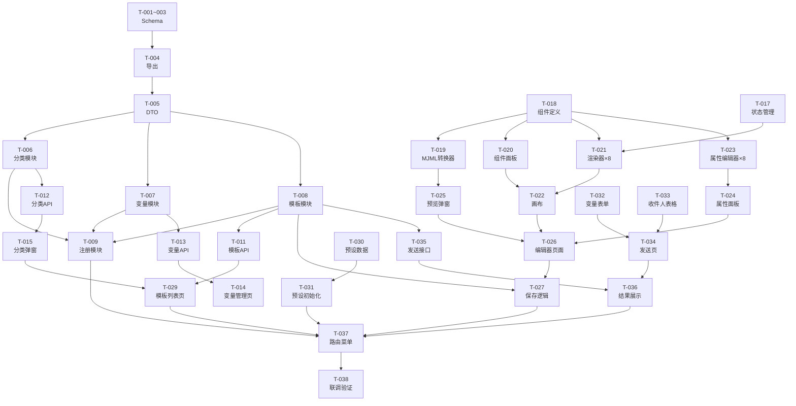

# 邮件模板管理 - 任务清单

## 概览

| 项目 | 数值 |
|------|------|
| 总任务数 | 38 |
| 可并行 | 12 |
| 预计工时 | 16h |

---

## M1 - 基础设施（3h）

### US-001: 数据模型与后端模块

| 任务 | 复杂度 | 并行 | 文件 | 状态 |
|------|--------|------|------|------|
| T-001 创建模板 Entity | S | ✅ | `server/.../schema/tb_mail_template.ts` | ⬜ |
| T-002 创建分类 Entity | S | ✅ | `server/.../schema/tb_mail_template_category.ts` | ⬜ |
| T-003 创建变量 Entity | S | ✅ | `server/.../schema/tb_mail_template_variable.ts` | ⬜ |
| T-004 注册 Schema 导出 | S | - | `server/.../database.schema.ts` | ⬜ |
| T-005 创建 DTO 类型 | S | - | `server/interface/swagger/mail-template.dto.ts` | ⬜ |
| T-006 分类 Controller+Service+Module | M | ✅ | `server/modules/mail-template-category/` | ⬜ |
| T-007 变量 Controller+Service+Module | M | ✅ | `server/modules/mail-template-variable/` | ⬜ |
| T-008 模板 Controller+Service+Module | M | - | `server/modules/mail-template/` | ⬜ |
| T-009 注册模块到 AppModule | S | - | `server/app.module.ts` | ⬜ |
| T-010 安装后端依赖 mjml | S | ✅ | `package.json` | ⬜ |

### 详细任务

- [ ] [P][S] **T-001**: 创建 `SchemaMailTemplate` Entity — `server/modules/database/schema/tb_mail_template.ts`
  - 字段：keyId, userId, categoryId, name, description, mjmlSource(mediumtext), htmlContent(mediumtext), canvasJson(text), thumbnail, isPreset, createTime, modifyTime
  - 验收：TypeORM synchronize 自动建表成功

- [ ] [P][S] **T-002**: 创建 `SchemaMailTemplateCategory` Entity — `server/modules/database/schema/tb_mail_template_category.ts`
  - 字段：keyId, userId, name, sort, createTime
  - 验收：建表成功

- [ ] [P][S] **T-003**: 创建 `SchemaMailTemplateVariable` Entity — `server/modules/database/schema/tb_mail_template_variable.ts`
  - 字段：keyId, userId, name, varKey, defaultValue, createTime
  - 唯一约束：`UNIQUE(userId, varKey)`
  - 验收：建表成功

- [ ] [S] **T-004**: 注册 Schema 导出（依赖 T-001~T-003）— `server/modules/database/database.schema.ts`
  - 添加 3 行 export

- [ ] [S] **T-005**: 创建 DTO 类型定义（依赖 T-001~T-003）— `server/interface/swagger/mail-template.dto.ts`
  - SaveTemplateOptions, SaveCategoryOptions, SaveVariableOptions, SendTemplateOptions

- [ ] [P][M] **T-006**: 分类 CRUD Service+Controller+Module（依赖 T-002, T-005）— `server/modules/mail-template-category/`
  - 接口：list, save, delete
  - 删除分类时将模板 categoryId 置 null
  - 验收：3 个接口可通过 Postman/curl 调用

- [ ] [P][M] **T-007**: 变量 CRUD Service+Controller+Module（依赖 T-003, T-005）— `server/modules/mail-template-variable/`
  - 接口：list, save, delete
  - save 时校验 varKey 唯一性
  - 验收：3 个接口可调用

- [ ] [M] **T-008**: 模板 CRUD Service+Controller+Module 骨架（依赖 T-001, T-005）— `server/modules/mail-template/`
  - 接口：list, detail, save, delete, copy, compile
  - save 时服务端调用 mjml 编译 htmlContent
  - 验收：6 个接口可调用

- [ ] [S] **T-009**: 注册所有模块到 AppModule（依赖 T-006~T-008）— `server/app.module.ts`

- [ ] [P][S] **T-010**: 安装后端依赖 `mjml` — `package.json`

---

### US-002: 前端 API 层与管理页

| 任务 | 复杂度 | 并行 | 文件 | 状态 |
|------|--------|------|------|------|
| T-011 前端模板 API | S | ✅ | `web/api/modules/web-mail-template.service.ts` | ⬜ |
| T-012 前端分类 API | S | ✅ | `web/api/modules/web-mail-template-category.service.ts` | ⬜ |
| T-013 前端变量 API | S | ✅ | `web/api/modules/web-mail-template-variable.service.ts` | ⬜ |
| T-014 变量管理页 | M | - | `web/views/manager/pages/manager-template-vars.vue` | ⬜ |
| T-015 分类管理弹窗 | S | - | `web/.../template-editor/CategoryDialog.vue` | ⬜ |

### 详细任务

- [ ] [P][S] **T-011**: 创建前端模板 API — `web/api/modules/web-mail-template.service.ts`
  - httpFetchTemplates, httpFetchTemplateDetail, httpSaveTemplate, httpDeleteTemplate, httpCopyTemplate, httpCompileTemplate, httpSendTemplate

- [ ] [P][S] **T-012**: 创建前端分类 API — `web/api/modules/web-mail-template-category.service.ts`
  - httpFetchCategories, httpSaveCategory, httpDeleteCategory

- [ ] [P][S] **T-013**: 创建前端变量 API — `web/api/modules/web-mail-template-variable.service.ts`
  - httpFetchVariables, httpSaveVariable, httpDeleteVariable

- [ ] [M] **T-014**: 创建变量管理页（依赖 T-013）— `web/views/manager/pages/manager-template-vars.vue`
  - 表格展示变量列表 + 新建/编辑弹窗 + 删除
  - 验收：变量 CRUD 全链路可用

- [ ] [S] **T-015**: 创建分类管理弹窗组件（依赖 T-012）— `web/views/manager/components/template-editor/CategoryDialog.vue`
  - 弹窗内列表编辑分类 + 新建/删除

---

## M2 - 拖拽编辑器（6h）

### US-003: 编辑器核心

| 任务 | 复杂度 | 并行 | 文件 | 状态 |
|------|--------|------|------|------|
| T-016 安装前端依赖 | S | ✅ | `package.json` | ⬜ |
| T-017 编辑器状态 composable | M | - | `useEditorState.ts` | ⬜ |
| T-018 组件类型 & 默认属性 | M | - | `componentDefs.ts` | ⬜ |
| T-019 canvasJson→MJML 转换器 | L | - | `mjmlCompiler.ts` | ⬜ |
| T-020 左侧组件面板 | S | - | `ComponentPanel.vue` | ⬜ |
| T-021 8个组件渲染器 | L | - | `renderers/*.vue` | ⬜ |
| T-022 中间画布(拖拽) | L | - | `CanvasView.vue` | ⬜ |
| T-023 8个属性编辑器 | L | - | `properties/*.vue` | ⬜ |
| T-024 右侧属性面板 | M | - | `PropertyPanel.vue` | ⬜ |
| T-025 预览弹窗 | S | - | `PreviewModal.vue` | ⬜ |
| T-026 编辑器页面组装 | M | - | `manager-template-editor.vue` | ⬜ |
| T-027 保存逻辑 | M | - | 编辑器页面 + service | ⬜ |
| T-028 撤销/重做 | S | - | `useEditorState.ts` | ⬜ |

### 详细任务

- [ ] [P][S] **T-016**: 安装 `mjml-browser` + `vue-draggable-plus` — `package.json`

- [ ] [M] **T-017**: 编辑器状态管理 composable — `web/views/manager/components/template-editor/useEditorState.ts`
  - CanvasNode 接口定义, EditorState reactive
  - addNode, removeNode, moveNode, updateNodeProps, selectNode
  - 验收：状态变更响应式生效

- [ ] [M] **T-018**: 组件类型定义 & 默认属性映射 — `web/views/manager/components/template-editor/componentDefs.ts`
  - MjmlComponentType 枚举
  - 每种组件的默认 props（如 mj-text 默认字体 14px）
  - 组件图标、名称、允许的子组件

- [ ] [L] **T-019**: canvasJson → MJML 源码转换器（依赖 T-018）— `web/views/manager/components/template-editor/mjmlCompiler.ts`
  - 递归遍历 CanvasNode[] 生成 MJML XML 字符串
  - 处理嵌套：section > column > content
  - 验收：输出合法 MJML，mjml-browser 可编译

- [ ] [S] **T-020**: 左侧组件面板（依赖 T-018）— `web/views/manager/components/template-editor/ComponentPanel.vue`
  - 按分组展示组件图标+名称
  - 支持拖拽出去（vue-draggable-plus 的 clone 模式）

- [ ] [L] **T-021**: 8 个组件渲染器（依赖 T-017, T-018）— `web/views/manager/components/template-editor/renderers/`
  - SectionRenderer, ColumnRenderer, TextRenderer, ImageRenderer, ButtonRenderer, DividerRenderer, SocialRenderer, HeroRenderer
  - 每个渲染器读取 node.props 渲染近似效果
  - TextRenderer 集成 CKEditor 5（双击编辑）
  - 验收：画布中组件外观接近邮件最终效果

- [ ] [L] **T-022**: 中间画布 CanvasView（依赖 T-020, T-021）— `web/views/manager/components/template-editor/CanvasView.vue`
  - vue-draggable-plus 实现拖入+排序
  - 嵌套拖拽（section 内拖 column，column 内拖内容）
  - 选中组件蓝色高亮边框 + 删除按钮
  - 验收：拖入→排序→选中→删除全链路通畅

- [ ] [L] **T-023**: 8 个属性编辑器（依赖 T-018）— `web/views/manager/components/template-editor/properties/`
  - SectionProps, ColumnProps, TextProps, ImageProps, ButtonProps, DividerProps, SocialProps, HeroProps
  - 每个编辑器用 Naive UI 表单组件
  - ImageProps 含图片上传按钮（调附件接口）
  - 验收：修改属性后画布实时更新

- [ ] [M] **T-024**: 右侧属性面板（依赖 T-023）— `web/views/manager/components/template-editor/PropertyPanel.vue`
  - 根据 selectedNode.type 动态切换属性编辑器
  - 无选中时显示「请选择组件」
  - 底部「删除组件」按钮 + 「插入变量」下拉

- [ ] [S] **T-025**: 预览弹窗（依赖 T-019）— `web/views/manager/components/template-editor/PreviewModal.vue`
  - canvasJson → MJML → mjml-browser 编译 → iframe sandbox 渲染
  - 桌面/手机视图切换（iframe 宽度变化）

- [ ] [M] **T-026**: 编辑器页面组装（依赖 T-020~T-025）— `web/views/manager/pages/manager-template-editor.vue`
  - 三栏布局：左 180px + 中 flex + 右 280px
  - 顶部工具栏：返回、模板名称、预览、保存按钮
  - 加载已有模板时从 canvasJson 恢复状态

- [ ] [M] **T-027**: 保存逻辑（依赖 T-019, T-008）— 编辑器页面 + `mail-template.service.ts`
  - 前端：canvasJson → MJML，连同 canvasJson 一起 POST
  - 后端：接收 mjmlSource，调 mjml 编译 htmlContent，三者一起存库

- [ ] [S] **T-028**: 撤销/重做（依赖 T-017）— `useEditorState.ts`
  - history 栈记录每次 canvas 变更快照
  - undo/redo 方法 + Ctrl+Z / Ctrl+Shift+Z 快捷键

---

## M3 - 模板列表 & 预设（2h）

### US-004: 模板管理与预设

| 任务 | 复杂度 | 并行 | 文件 | 状态 |
|------|--------|------|------|------|
| T-029 模板列表页 | L | - | `manager-templates.vue` | ⬜ |
| T-030 预设模板 JSON seed | M | ✅ | `preset-templates.ts` | ⬜ |
| T-031 预设初始化逻辑 | S | - | `mail-template.service.ts` | ⬜ |

### 详细任务

- [ ] [L] **T-029**: 模板列表页（依赖 T-011, T-015）— `web/views/manager/pages/manager-templates.vue`
  - 卡片网格布局（n-grid + n-card）
  - 分类 Tab 筛选 + 「管理分类」按钮
  - 每张卡片：缩略图/占位图 + 名称 + 分类标签
  - 操作：预览(弹窗)、编辑(跳编辑器)、复制、删除、使用发送(跳发送页)
  - 预设模板隐藏编辑/删除，只显示复制/预览/使用发送
  - 验收：列表展示+筛选+CRUD 操作正常

- [ ] [P][M] **T-030**: 创建 5 个预设模板 canvasJson — `server/modules/mail-template/preset-templates.ts`
  - P1 空白、P2 营销推广、P3 活动邀请、P4 周报、P5 通知
  - 每个含 canvasJson + 编译后 mjmlSource

- [ ] [S] **T-031**: 预设模板初始化逻辑（依赖 T-030）— `mail-template.service.ts`
  - 模块 onModuleInit 检查 isPreset 记录数
  - 不存在则批量插入 seed 数据（userId=0 表示系统级）

---

## M4 - 模板发送（3h）

### US-005: 模板发送与群发

| 任务 | 复杂度 | 并行 | 文件 | 状态 |
|------|--------|------|------|------|
| T-032 变量填充表单 | M | ✅ | `VariableForm.vue` | ⬜ |
| T-033 群发收件人表格 | M | ✅ | `RecipientTable.vue` | ⬜ |
| T-034 模板发送页面 | L | - | `manager-template-send.vue` | ⬜ |
| T-035 后端发送接口 | M | - | `mail-template.service.ts` | ⬜ |
| T-036 发送结果展示 | S | - | 发送页内 | ⬜ |

### 详细任务

- [ ] [P][M] **T-032**: 变量填充表单组件 — `web/views/manager/components/template-send/VariableForm.vue`
  - 自动解析模板 htmlContent 中的 `{{key}}` 提取变量列表
  - 结合用户已定义变量显示变量名 + 输入框 + 默认值
  - 验收：正确识别变量并可填充

- [ ] [P][M] **T-033**: 群发收件人表格组件 — `web/views/manager/components/template-send/RecipientTable.vue`
  - n-data-table 可编辑表格
  - 列：收件人邮箱 + 动态变量列
  - 「+ 添加」按钮追加行，行内删除按钮
  - 验收：可增删行并编辑每行变量

- [ ] [L] **T-034**: 模板发送页面（依赖 T-032, T-033）— `web/views/manager/pages/manager-template-send.vue`
  - 左侧模板预览（iframe 渲染 htmlContent）
  - 右侧：发件人下拉 + 收件人输入 + 变量表单 + 群发开关
  - 群发模式切换为 RecipientTable
  - 「预览最终效果」按钮：替换变量后弹窗
  - 「发送」按钮

- [ ] [M] **T-035**: 后端模板发送接口（依赖 T-008）— `server/modules/mail-template/mail-template.service.ts`
  - 接收 templateId + accountId + recipients[]
  - 查模板 htmlContent，逐收件人替换变量
  - 调用现有 smtpSend 逐条发送
  - 记录 tb_mail_message（folder='Sent'）
  - 返回成功/失败汇总

- [ ] [S] **T-036**: 发送结果展示（依赖 T-035）— 发送页内
  - 发送完成后弹窗/区域展示：成功 N / 失败 M
  - 失败的显示原因 + 重试按钮

---

## M5 - 联调验证（2h）

### US-006: 集成与验证

| 任务 | 复杂度 | 并行 | 文件 | 状态 |
|------|--------|------|------|------|
| T-037 路由 & 菜单注册 | S | - | `router/index.ts` + 菜单配置 | ⬜ |
| T-038 全链路联调验证 | L | - | - | ⬜ |

### 详细任务

- [ ] [S] **T-037**: 注册路由 & 侧栏菜单（依赖 M1-M4）— `web/router/index.ts` + 菜单配置
  - /manager/templates → 模板列表
  - /manager/template-editor/:id? → 编辑器
  - /manager/template-send/:id → 模板发送
  - /manager/template-vars → 变量管理
  - 侧栏增加「📋 邮件模板」一级菜单 + 子菜单

- [ ] [L] **T-038**: 全链路联调 & Bug 修复 — 全项目
  - 验证流程：新建分类 → 新建模板 → 拖拽编辑 → 保存 → 列表查看 → 复制 → 使用发送 → 群发
  - 浏览器自动化测试关键路径
  - 修复发现的 Bug，样式微调

---

## 执行依赖图

