# 邮件模板管理 - 开发计划

## MVP 定义

### 必须实现（M1-M3）
- [ ] 数据库 Schema（3 张表）+ TypeORM Entity
- [ ] 后端模块骨架（Controller + Service × 3）
- [ ] 模板分类 CRUD
- [ ] 模板变量 CRUD
- [ ] 拖拽编辑器（8 类组件 + 画布 + 属性面板）
- [ ] 模板 CRUD（列表/保存/删除/复制/预览）
- [ ] 5 个预设模板 seed 数据
- [ ] 模板发送（变量替换 + 群发）
- [ ] 路由 & 侧栏菜单集成

### 可延后
- [ ] 模板缩略图自动生成
- [ ] 撤销/重做高级优化（合并连续操作）
- [ ] 发送进度实时推送（WebSocket）
- [ ] 模板导入/导出

## 里程碑

| 里程碑 | 目标 | 预计工时 | 交付物 |
|--------|------|----------|--------|
| **M1 - 基础设施** | Schema + 后端模块 + 分类/变量 CRUD + 前端 API 层 | 3h | 3 张表 + 3 组 CRUD 接口 + 前端联调 |
| **M2 - 拖拽编辑器** | 组件面板 + 画布拖拽 + 属性面板 + 预览 + 保存 | 6h | 可用的三栏编辑器页面 |
| **M3 - 模板列表 & 预设** | 卡片列表页 + 分类筛选 + 预设模板初始化 | 2h | 完整的模板管理列表 |
| **M4 - 模板发送** | 发送页 + 变量填充 + 群发 + SMTP 投递 | 3h | 端到端模板发送 |
| **M5 - 联调验证** | 全链路验证 + Bug 修复 + 侧栏菜单 | 2h | 功能完整可用 |

**总预计工时：16h**

## 详细任务清单

### M1 - 基础设施（3h）

| # | 任务 | 文件 | 工时 | 依赖 |
|---|------|------|------|------|
| 1.1 | 创建 `SchemaMailTemplate` Entity | `server/modules/database/schema/tb_mail_template.ts` | 15min | - |
| 1.2 | 创建 `SchemaMailTemplateCategory` Entity | `server/modules/database/schema/tb_mail_template_category.ts` | 10min | - |
| 1.3 | 创建 `SchemaMailTemplateVariable` Entity | `server/modules/database/schema/tb_mail_template_variable.ts` | 10min | - |
| 1.4 | 注册 Schema 导出 | `server/modules/database/database.schema.ts` | 5min | 1.1-1.3 |
| 1.5 | 创建 DTO 类型定义 | `server/interface/swagger/mail-template.dto.ts` | 15min | 1.1-1.3 |
| 1.6 | 创建模板分类 Service + Controller + Module | `server/modules/mail-template-category/` | 20min | 1.2, 1.5 |
| 1.7 | 创建模板变量 Service + Controller + Module | `server/modules/mail-template-variable/` | 20min | 1.3, 1.5 |
| 1.8 | 创建模板 Service + Controller + Module（骨架） | `server/modules/mail-template/` | 25min | 1.1, 1.5 |
| 1.9 | 注册所有模块到 AppModule | `server/app.module.ts` | 5min | 1.6-1.8 |
| 1.10 | 安装后端依赖 `mjml` | `package.json` | 5min | - |
| 1.11 | 创建前端 API 层 | `web/api/modules/web-mail-template*.service.ts` | 15min | 1.6-1.8 |
| 1.12 | 创建前端变量管理页 | `web/views/manager/pages/manager-template-vars.vue` | 20min | 1.7, 1.11 |
| 1.13 | 创建前端分类管理弹窗组件 | `web/views/manager/components/template-editor/CategoryDialog.vue` | 15min | 1.6, 1.11 |

### M2 - 拖拽编辑器（6h）

| # | 任务 | 文件 | 工时 | 依赖 |
|---|------|------|------|------|
| 2.1 | 安装前端依赖 `mjml-browser` + `vue-draggable-plus` | `package.json` | 5min | - |
| 2.2 | 定义编辑器状态管理 composable | `web/views/manager/components/template-editor/useEditorState.ts` | 30min | - |
| 2.3 | 定义 MJML 组件类型 & 默认属性 | `web/views/manager/components/template-editor/componentDefs.ts` | 20min | - |
| 2.4 | 实现 canvasJson → MJML 源码转换器 | `web/views/manager/components/template-editor/mjmlCompiler.ts` | 30min | 2.3 |
| 2.5 | 实现左侧组件面板 ComponentPanel | `web/views/manager/components/template-editor/ComponentPanel.vue` | 20min | 2.3 |
| 2.6 | 实现 8 个组件渲染器 | `web/views/manager/components/template-editor/renderers/*.vue` | 60min | 2.2, 2.3 |
| 2.7 | 实现中间画布 CanvasView（拖拽） | `web/views/manager/components/template-editor/CanvasView.vue` | 40min | 2.5, 2.6 |
| 2.8 | 实现 8 个属性编辑器 | `web/views/manager/components/template-editor/properties/*.vue` | 60min | 2.2, 2.3 |
| 2.9 | 实现右侧属性面板 PropertyPanel | `web/views/manager/components/template-editor/PropertyPanel.vue` | 20min | 2.8 |
| 2.10 | 实现预览弹窗 PreviewModal | `web/views/manager/components/template-editor/PreviewModal.vue` | 20min | 2.4 |
| 2.11 | 组装编辑器页面 | `web/views/manager/pages/manager-template-editor.vue` | 30min | 2.5-2.10 |
| 2.12 | 实现保存逻辑（canvasJson + mjml + html） | 2.11 + `mail-template.service.ts` | 20min | 2.4, 1.8 |
| 2.13 | 实现撤销/重做 | `useEditorState.ts` | 15min | 2.2 |

### M3 - 模板列表 & 预设（2h）

| # | 任务 | 文件 | 工时 | 依赖 |
|---|------|------|------|------|
| 3.1 | 实现模板列表页（卡片布局 + 分类筛选） | `web/views/manager/pages/manager-templates.vue` | 40min | 1.11, 1.13 |
| 3.2 | 实现模板预览弹窗 | 3.1 内 | 15min | 3.1 |
| 3.3 | 实现模板复制功能 | `mail-template.service.ts` | 10min | 1.8 |
| 3.4 | 创建 5 个预设模板 JSON seed | `server/modules/mail-template/preset-templates.ts` | 30min | 2.3 |
| 3.5 | 实现预设模板初始化逻辑 | `mail-template.service.ts` | 15min | 3.4 |
| 3.6 | 后端编译接口（MJML→HTML） | `mail-template.controller.ts` | 10min | 1.10 |

### M4 - 模板发送（3h）

| # | 任务 | 文件 | 工时 | 依赖 |
|---|------|------|------|------|
| 4.1 | 实现变量填充表单组件 | `web/views/manager/components/template-send/VariableForm.vue` | 25min | 1.11 |
| 4.2 | 实现群发收件人表格组件 | `web/views/manager/components/template-send/RecipientTable.vue` | 30min | - |
| 4.3 | 实现模板发送页面 | `web/views/manager/pages/manager-template-send.vue` | 40min | 4.1, 4.2 |
| 4.4 | 实现后端模板发送接口（变量替换 + 群发） | `mail-template.service.ts` | 30min | 1.8 |
| 4.5 | 实现发送结果展示（成功/失败汇总） | 4.3 内 | 15min | 4.4 |
| 4.6 | 群发失败重试 | 4.4 + 4.3 | 15min | 4.4 |

### M5 - 联调验证（2h）

| # | 任务 | 文件 | 工时 | 依赖 |
|---|------|------|------|------|
| 5.1 | 注册路由 | `web/router/index.ts` | 10min | M1-M4 |
| 5.2 | 侧栏菜单增加模板相关入口 | 菜单配置 | 10min | 5.1 |
| 5.3 | 全链路联调测试 | - | 40min | M1-M4 |
| 5.4 | Bug 修复 & 样式微调 | - | 40min | 5.3 |
| 5.5 | 浏览器自动化验证 | - | 20min | 5.4 |

## 执行顺序

```mermaid
gantt
    title 邮件模板管理 - 开发甘特图
    dateFormat HH:mm
    axisFormat %H:%M

    section M1 基础设施
    Schema & DTO           :m1a, 00:00, 55min
    后端 Service/Controller :m1b, after m1a, 70min
    前端 API & 管理页       :m1c, after m1b, 50min

    section M2 拖拽编辑器
    状态管理 & 类型定义     :m2a, after m1b, 50min
    组件渲染器(8个)         :m2b, after m2a, 60min
    画布 & 面板组装          :m2c, after m2b, 80min
    编辑器页面 & 保存        :m2d, after m2c, 50min

    section M3 列表 & 预设
    列表页 & 分类筛选       :m3a, after m2d, 55min
    预设模板 seed           :m3b, after m3a, 45min

    section M4 模板发送
    发送页 & 群发           :m4a, after m3b, 105min
    结果展示 & 重试          :m4b, after m4a, 30min

    section M5 联调验证
    路由集成 & 联调          :m5a, after m4b, 60min
    Bug修复 & 验证           :m5b, after m5a, 60min
```

## 风险识别

| 风险 | 概率 | 影响 | 应对措施 |
|------|------|------|----------|
| `mjml-browser` 包体积过大影响首屏 | 中 | 中 | 动态 import 懒加载，仅编辑器页加载 |
| CKEditor 与 vue-draggable-plus 事件冲突 | 中 | 高 | 文本块编辑时禁用拖拽，分层处理事件 |
| MJML 组件嵌套规则复杂 | 低 | 中 | 严格约束画布结构：section→column→内容组件 |
| 群发大量邮件 SMTP 超时 | 中 | 中 | 逐条发送 + 失败重试，可设置发送间隔 |
| 预设模板 canvasJson 结构变更 | 低 | 低 | 版本号管理，向后兼容 |

## 依赖项

| 依赖 | 状态 | 阻塞 |
|------|------|------|
| `mjml` npm 包 | 待安装 | 否（M1 安装） |
| `mjml-browser` npm 包 | 待安装 | 否（M2 安装） |
| `vue-draggable-plus` npm 包 | 待安装 | 否（M2 安装） |
| 现有附件上传接口 | ✅ 已就绪 | 否 |
| 现有 SMTP 发送通道 | ✅ 已就绪 | 否 |
| CKEditor 5 集成 | ✅ 已就绪 | 否 |
