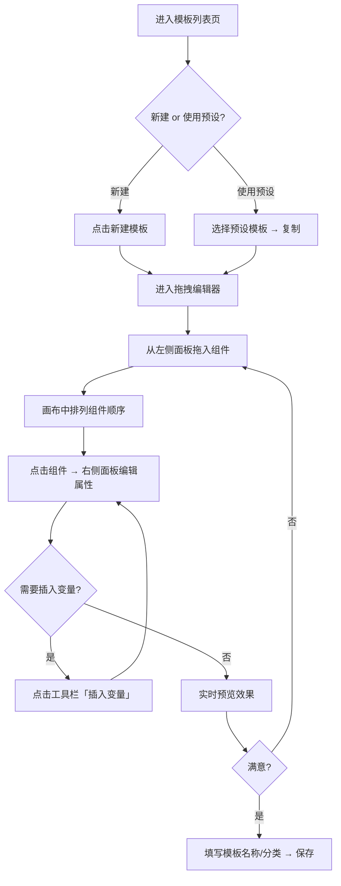
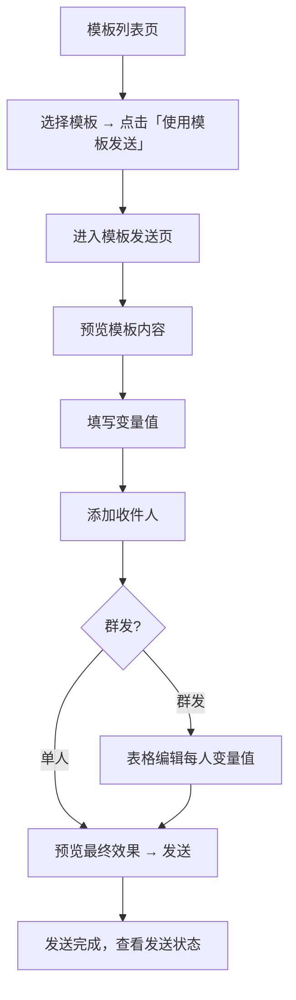
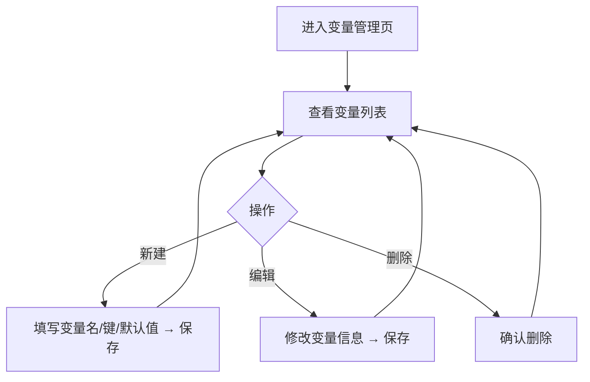

# 邮件模板管理 - 产品设计 V1

## 1. 功能概述

通过拖拽式可视化编辑器，用户无需编写代码即可快速构建响应式邮件模板，并支持变量占位符群发，实现个性化邮件批量沟通。

## 2. 目标用户

| 用户角色 | 特征 | 使用场景 |
|----------|------|----------|
| 邮件运营人员 | 每周发送 3~5 次格式化邮件 | 构建营销/活动模板，批量群发给客户 |
| 普通用户 | 偶尔需要发送精美邮件 | 选预设模板，微调后发送周报/通知 |

## 3. 用户流程

### 3.1 创建模板流程



### 3.2 使用模板发送邮件流程



### 3.3 管理模板变量流程



## 4. 功能清单

### 4.1 模板列表管理
- [ ] 卡片式展示模板（缩略图 + 名称 + 分类标签 + 操作按钮）
- [ ] 按分类筛选（Tab 或下拉切换）
- [ ] 新建模板（跳转编辑器）
- [ ] 编辑模板（跳转编辑器）
- [ ] 删除模板（二次确认）
- [ ] 复制模板（基于现有模板创建副本）
- [ ] 预览模板（弹窗渲染 HTML 效果）
- [ ] 分类管理（新建/编辑/删除分类，弹窗操作）

### 4.2 预设模板
- [ ] 5 个系统内置模板（空白、营销推广、活动邀请、周报、通知）
- [ ] 预设模板标记「系统」标签，不可编辑/删除
- [ ] 预设模板可「复制」为个人模板后编辑

### 4.3 拖拽编辑器
- [ ] 左侧组件面板（8 类 MJML 组件图标+名称）
- [ ] 拖拽组件到中间画布
- [ ] 画布内拖拽排序
- [ ] 点击组件选中高亮
- [ ] 右侧属性面板联动（根据组件类型显示对应属性表单）
- [ ] 文本块内嵌 CKEditor 5 富文本编辑
- [ ] 图片组件支持上传（调用附件接口）
- [ ] 实时预览（MJML → HTML 编译渲染）
- [ ] 撤销/重做
- [ ] 删除选中组件
- [ ] 工具栏「插入变量」下拉菜单
- [ ] 保存（填写名称/分类 → 存储 MJML + HTML）

### 4.4 模板变量管理
- [ ] 变量列表（表格展示：变量名、变量键、默认值）
- [ ] 新建变量
- [ ] 编辑变量
- [ ] 删除变量（检查是否被模板引用，提示用户）

### 4.5 模板发送
- [ ] 模板预览区（左侧/上方展示 HTML 渲染效果）
- [ ] 变量填充表单（自动识别模板中的 `{{}}` 变量）
- [ ] 收件人选择（支持手动输入、多人添加）
- [ ] 群发模式：表格编辑每个收件人对应的变量值
- [ ] 发送前预览（替换变量后的最终效果）
- [ ] 发件人选择（复用现有邮箱账号下拉）
- [ ] 发送（调用现有 SMTP 通道）
- [ ] 发送结果反馈

## 5. 界面原型

### 5.1 模板列表页 `/manager/templates`

```
┌─────────────────────────────────────────────────────────────┐
│  📋 邮件模板                              [+ 新建模板]       │
├─────────────────────────────────────────────────────────────┤
│  分类: [全部] [营销] [通知] [周报] [活动] [管理分类...]       │
├─────────────────────────────────────────────────────────────┤
│  ┌──────────┐  ┌──────────┐  ┌──────────┐  ┌──────────┐   │
│  │ 缩略图    │  │ 缩略图    │  │ 缩略图    │  │ 缩略图    │   │
│  │          │  │          │  │          │  │          │   │
│  ├──────────┤  ├──────────┤  ├──────────┤  ├──────────┤   │
│  │ 营销推广  │  │ 活动邀请  │  │ 周报模板  │  │ 我的模板  │   │
│  │ [系统]    │  │ [系统]    │  │ [系统]    │  │ [营销]    │   │
│  │ 预览 复制 │  │ 预览 复制 │  │ 预览 复制 │  │ 编辑 删除 │   │
│  │ 使用发送  │  │ 使用发送  │  │ 使用发送  │  │ 使用发送  │   │
│  └──────────┘  └──────────┘  └──────────┘  └──────────┘   │
└─────────────────────────────────────────────────────────────┘
```

### 5.2 拖拽编辑器页 `/manager/template-editor/:id?`

```
┌───────────────────────────────────────────────────────────────────┐
│  ← 返回          模板编辑器 - {模板名称}         [预览] [保存]    │
├──────────┬───────────────────────────────┬────────────────────────┤
│ 组件面板  │         画布区域              │      属性面板          │
│ (180px)  │                              │      (280px)           │
│          │                              │                        │
│ 📦 布局   │  ┌─────────────────────────┐ │  ✏️ mj-text 属性       │
│ ├ 段落容器│  │  [mj-section]           │ │                        │
│ ├ 列布局  │  │  ┌─────┐ ┌─────┐       │ │  字体大小: [14px ▾]     │
│          │  │  │col-1│ │col-2│       │ │  文字颜色: [#333 🎨]    │
│ 📝 内容   │  │  │text │ │image│       │ │  行高:     [1.5  ▾]     │
│ ├ 文本块  │  │  └─────┘ └─────┘       │ │  对齐:     [左 中 右]    │
│ ├ 图片   │  │  [mj-section]           │ │  内边距:   [10px]       │
│ ├ 按钮   │  │  ┌───────────────┐      │ │                        │
│ ├ 分隔线  │  │  │   mj-button   │      │ │  内容:                 │
│ ├ 社交链接│  │  └───────────────┘      │ │  ┌──────────────────┐  │
│ ├ 横幅   │  │  [mj-divider]           │ │  │ CKEditor 5 区域   │  │
│          │  │  ─────────────────       │ │  │                  │  │
│          │  └─────────────────────────┘ │  └──────────────────┘  │
│ 📌 工具   │                              │                        │
│ ├ 插入变量│                              │                        │
├──────────┴───────────────────────────────┴────────────────────────┤
│  撤销 ↩  重做 ↪  │  组件: 5 个  │  最后保存: 12:30                │
└───────────────────────────────────────────────────────────────────┘
```

### 5.3 模板发送页 `/manager/template-send/:id`

```
┌───────────────────────────────────────────────────────────────────┐
│  ← 返回              使用模板发送邮件                  [发送]     │
├─────────────────────────────────┬─────────────────────────────────┤
│        模板预览                 │        发送设置                  │
│                                │                                 │
│  ┌───────────────────────────┐ │  发件人: [limvcfast@163... ▾]   │
│  │                           │ │                                 │
│  │   渲染后的 HTML 邮件效果    │ │  收件人:                        │
│  │                           │ │  [user1@xx.com ×] [+ 添加]      │
│  │   尊敬的 {{姓名}}，        │ │                                 │
│  │   感谢您参加...            │ │  ── 变量填充 ──                  │
│  │                           │ │  姓名:  [张三        ]           │
│  │   {{公司}} 团队            │ │  公司:  [示例科技     ]           │
│  │                           │ │                                 │
│  └───────────────────────────┘ │  ☑ 群发模式                     │
│                                │  ┌────┬──────┬──────┐           │
│                                │  │收件人│ 姓名  │ 公司  │           │
│                                │  ├────┼──────┼──────┤           │
│                                │  │u1@..│ 张三  │ A公司 │           │
│                                │  │u2@..│ 李四  │ B公司 │           │
│                                │  └────┴──────┴──────┘           │
│                                │  [+ 添加收件人]                   │
├─────────────────────────────────┴─────────────────────────────────┤
│                        [预览最终效果]  [发送]                      │
└───────────────────────────────────────────────────────────────────┘
```

### 5.4 模板变量管理页 `/manager/template-vars`

```
┌─────────────────────────────────────────────────────────────┐
│  🔤 模板变量管理                            [+ 新建变量]     │
├─────────────────────────────────────────────────────────────┤
│  变量名     │  变量键      │  默认值       │  操作           │
│─────────────┼─────────────┼──────────────┼─────────────────│
│  姓名       │  name       │  用户         │  编辑  删除      │
│  公司       │  company    │  我司         │  编辑  删除      │
│  职位       │  position   │  -           │  编辑  删除      │
│  日期       │  date       │  (自动)       │  编辑  删除      │
└─────────────────────────────────────────────────────────────┘
```

## 6. 交互设计

### 6.1 拖拽编辑器交互

| 操作 | 行为 |
|------|------|
| **拖入组件** | 从左侧面板拖拽到画布，释放时在对应位置插入，画布出现蓝色插入指示线 |
| **画布内排序** | 拖拽已有组件上下移动排序，其他组件自动让位 |
| **选中组件** | 单击画布中的组件，蓝色虚线框高亮，右侧面板切换为该组件属性 |
| **编辑文本** | 双击 mj-text 组件进入 CKEditor 行内编辑模式 |
| **删除组件** | 选中后按 Delete 键，或右侧面板底部「删除」按钮 |
| **撤销/重做** | Ctrl+Z / Ctrl+Shift+Z，或底部工具栏按钮 |
| **预览** | 点击顶部「预览」按钮，弹窗展示编译后 HTML（桌面+手机视图切换） |
| **保存** | 点击「保存」，首次弹窗填写名称+分类，后续直接保存 |
| **插入变量** | 在 mj-text 编辑中，点击「插入变量」下拉选择，插入 `{{key}}` 文本 |

### 6.2 模板发送交互

| 操作 | 行为 |
|------|------|
| **切换群发** | 勾选「群发模式」，切换为表格编辑，每行一个收件人+对应变量 |
| **添加收件人** | 表格底部「+ 添加」按钮追加一行 |
| **预览最终效果** | 替换变量后弹窗渲染，群发模式下可切换预览不同收件人的效果 |
| **发送** | 点击发送后显示进度条，逐个投递，完成后展示成功/失败汇总 |

### 6.3 分类管理交互

| 操作 | 行为 |
|------|------|
| **管理分类** | 点击「管理分类...」弹出对话框，列表编辑 |
| **新建分类** | 对话框内输入名称 → 保存 |
| **删除分类** | 确认弹窗提示「分类下 N 个模板将移到未分类」 |

## 7. 边界情况

| 场景 | 处理方式 |
|------|----------|
| 画布为空时保存 | 禁用保存按钮，tooltip 提示「请至少添加一个组件」 |
| MJML 编译失败 | 预览区显示错误提示，保存时提示「模板结构异常，请检查」|
| 模板名称重复 | 保存时提示「模板名称已存在，请修改」 |
| 预设模板操作 | 编辑/删除按钮隐藏，只显示预览/复制/使用发送 |
| 删除分类有模板 | 确认弹窗明确告知影响范围，模板归入未分类 |
| 群发 0 个收件人 | 发送按钮禁用 |
| 群发部分失败 | 完成后展示结果表格：成功 N / 失败 M，失败的可重发 |
| 变量被模板引用 | 删除时提示「该变量被 N 个模板使用，删除后模板中将显示原始占位符」 |
| 图片上传超 25M | 复用附件接口限制，前端提示「文件过大」 |
| 网络断开时保存 | 提示保存失败，数据保留在编辑器中不丢失 |
